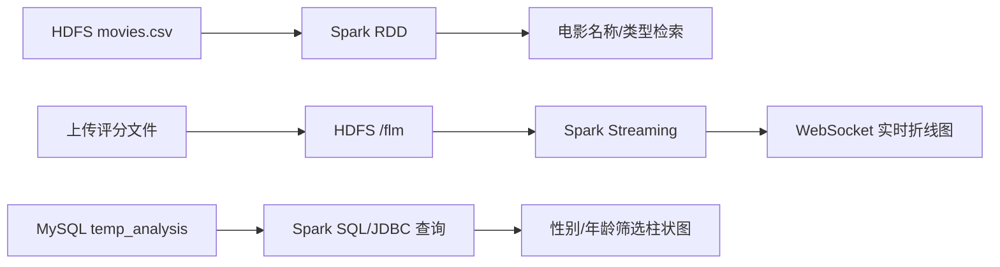

<div align="center">

<h1>🎬 Spark 电影评分大数据分析平台</h1>

<p><strong>把 HDFS 中的电影与评分数据，转换成可检索、可实时观察、可按人群分析的 Web 图表。</strong></p>

<p>
  <code>Spark RDD</code> ·
  <code>Spark Streaming</code> ·
  <code>Spark SQL</code> ·
  <code>Spring Boot</code> ·
  <code>Hadoop</code> ·
  <code>MySQL</code> ·
  <code>Vue</code> ·
  <code>ECharts</code>
</p>

</div>

---

> **项目定位**
>
> 这是一个 Spark 全栈教学示例：后端连接 HDFS 和 MySQL 完成批处理、流处理及统计查询，前端将结果展示为数据表格、实时折线图和分类柱状图。

> **兼容性提醒**
>
> 项目最初完成于 2019 年，使用 Spring Boot 1.5、Spark 2.4 和 Hadoop 2.7。推荐使用 **JDK 8** 运行，不建议在未做兼容性改造的情况下直接升级 JDK 或核心依赖。

## ✨ 核心能干什么

| 核心能力 | 数据从哪里来 | Spark 如何处理 | 最终能看到什么 |
| --- | --- | --- | --- |
| 🔎 **检索电影** | HDFS 中的 `movies.csv` | 使用 Spark 读取 CSV，按电影名称和类型过滤 | 可分页的电影 ID、名称和类型列表 |
| 📈 **观察实时评分** | 上传到 HDFS `/flm` 的新评分文件 | Spark Streaming 每 20 秒监听一次，并提取评分字段 | WebSocket 实时推送的评分折线图 |
| 📊 **分析观影偏好** | MySQL `temp_analysis` 表 | Spark SQL 负责关联/写入分析数据，页面按性别、年龄段和类型聚合查询 | 不同电影类型的平均分柱状图 |

三个功能分别对应以下页面：

| 页面 | 地址 | 用途 |
| --- | --- | --- |
| Spark RDD | <http://localhost:8080/spark_rdd.html> | 按名称、类型搜索电影 |
| Spark Streaming | <http://localhost:8080/spark_streaming.html> | 上传评分文件并观察实时曲线 |
| Spark SQL | <http://localhost:8080/spark_sql.html> | 按性别、年龄段分析类型平均分 |

## 🧩 运行前置条件

### 基础环境

| 必需组件 | 建议版本 | 作用 |
| --- | --- | --- |
| **JDK** | 8 | 编译和运行 Spring Boot、Spark |
| **Maven** | 3.x | 下载依赖并构建项目 |
| **Hadoop / HDFS** | 2.7.x | 保存 `movies.csv` 和 Streaming 输入文件 |
| **MySQL** | 5.x | 保存 `temp_analysis` 统计数据 |
| **浏览器** | Chrome、Edge 等现代浏览器 | 打开 Vue/ECharts 数据页面 |

Windows 本地运行还需要与 Hadoop 版本匹配的辅助文件（例如 `winutils.exe`），并将 `hadoop.home.dir` 指向正确的 Hadoop 目录。

### 数据与服务检查清单

启动项目前，请确认：

- ✅ JDK 8 和 Maven 已安装，`java -version`、`mvn -version` 可以正常执行。
- ✅ HDFS NameNode 已启动，并且本机能够访问其地址。
- ✅ `movies.csv` 已上传到 HDFS `/dataset/movies.csv`。
- ✅ HDFS `/flm` 目录可创建或可写，用于接收 Streaming 文件。
- ✅ MySQL 中已创建 `sparktest` 数据库，并导入 `src/main/resources/db/temp_analysis.sql`。
- ✅ 已按照实际环境修改 HDFS 地址、Hadoop 目录、Hadoop 用户以及 MySQL 账号密码。
- ✅ 本机 `8080` 端口未被占用。
- ✅ 浏览器可以访问 `unpkg.com`；如果处于离线环境，需要将 Element UI 样式改为本地资源。

## 🗺️ 数据如何流转



## 🛠️ 技术栈

| 组件 | 版本或说明 |
| --- | --- |
| Java | 1.8 |
| Spring Boot | 1.5.21.RELEASE |
| Apache Spark | 2.4.0，Scala 2.11 构件 |
| Hadoop | 2.7.3 |
| MySQL Connector/J | 5.1.39 |
| 前端 | Vue 2、Element UI、Axios、ECharts |
| 构建工具 | Maven |

## ⚙️ 配置说明

项目当前将演示环境的地址和凭据直接写在 Java 代码中。启动前至少检查以下位置：

| 配置项 | 当前值 | 代码位置 |
| --- | --- | --- |
| Spark Master | `local[*]` | `SparkConfig.java` |
| 本地 Hadoop 目录 | `F:/hadoop-2.7.4` | `SparkConfig.java` |
| Hadoop 用户 | `root` | `SparkConfig.java` |
| HDFS NameNode | `hdfs://192.168.233.128:9000` | `MoviesController.java`、`WebSocketServer.java`、`SparkSqlUtils.java` |
| 电影数据 | `/dataset/movies.csv` | `MoviesController.java`、`SparkSqlUtils.java` |
| Streaming 监听目录 | `/flm` | `WebSocketServer.java` |
| MySQL 数据库 | `jdbc:mysql://localhost:3306/sparktest` | `JavaDBCon.java`、`SparkSqlUtils.java` |
| MySQL 用户/密码 | `root` / `admin` | `JavaDBCon.java`、`SparkSqlUtils.java` |
| Web 服务端口 | `8080` | `application.properties` |

正式环境不要继续使用源码中的默认数据库凭据，建议改为通过环境变量或 Spring 配置文件注入。

## 🗄️ 数据准备

### 1. 导入 MySQL 数据

创建数据库并导入项目自带的 SQL 文件：

```sql
CREATE DATABASE sparktest CHARACTER SET utf8mb4;
```

```bash
mysql -uroot -p sparktest < src/main/resources/db/temp_analysis.sql
```

SQL 文件会创建并填充 `temp_analysis` 表，字段如下：

| 字段 | 类型 | 含义 |
| --- | --- | --- |
| `gender` | text | 性别，示例值为 `M`、`F` |
| `age` | text | 年龄段编码，如 `1`、`18`、`25`、`35`、`45`、`50`、`56` |
| `genres` | text | 电影类型，多个类型使用竖线分隔 |
| `rating` | text | 电影评分 |

### 2. 上传 HDFS 数据

RDD 查询默认读取：

```text
hdfs://192.168.233.128:9000/dataset/movies.csv
```

若需要重新生成 `temp_analysis` 数据，`SparkSqlUtils.java` 还预设了 `ratings.csv`、`users.dat` 和 `occupation.txt` 的 HDFS 路径。请根据实际集群修改路径并上传对应数据集。

### 3. Streaming 文件格式

上传接口会先把文件保存到 `src/main/resources/upload`，再复制到 HDFS `/flm`。每条记录至少需要包含三个逗号分隔字段，程序读取第 3 个字段作为评分。项目示例采用以下格式：

```text
[userId,movieId,rating,timestamp]
[255999,1073,2.0,859027721]
```

Spark Streaming 的文件流只处理监听启动后新进入目录的文件。测试时请使用新的文件名，不要只修改已经处理过的文件。

## 🚀 快速启动

在项目根目录执行：

```bash
mvn clean package
```

如果本机尚未接入 HDFS/MySQL，只想先验证编译和打包，可跳过测试：

```bash
mvn clean package -DskipTests
```

开发模式启动：

```bash
mvn spring-boot:run
```

也可以运行打包后的可执行 JAR：

```bash
java -jar target/sparkanalysis-0.0.1-SNAPSHOT.jar
```

应用启动后访问：

- RDD 查询：<http://localhost:8080/spark_rdd.html>
- Streaming 实时分析：<http://localhost:8080/spark_streaming.html>
- Spark SQL 分析：<http://localhost:8080/spark_sql.html>

## 🔌 接口说明

| 方法 | 地址 | 参数 | 说明 |
| --- | --- | --- | --- |
| POST | `/searchMovies` | `movieName`、`movieType` | 按名称和类型查询电影 |
| POST | `/doUpload` | multipart 字段 `file` | 保存文件并上传到 HDFS `/flm` |
| POST | `/getAllTypeAverageNum` | `gender`、`age` | 查询各电影类型的平均评分 |
| WebSocket | `/websocket/getStreamingAnalysis` | 无 | 接收 Streaming 推送的评分数据 |

接口统一返回类似以下结构：

```json
{
  "status": "200",
  "message": "查询成功！",
  "data": {}
}
```

## 📁 项目结构

```text
sparkproject/
├─ pom.xml
├─ src/main/java/com/myspark/sparkanalysis/
│  ├─ config/                 # Spark 与 WebSocket 配置
│  ├─ dto/                    # 接口响应对象
│  ├─ pojo/                   # 电影数据模型
│  ├─ service/                # RDD、Streaming、SQL 处理逻辑
│  ├─ utils/                  # JDBC、Spark SQL 等工具
│  └─ web/                    # REST 与 WebSocket 入口
└─ src/main/resources/
   ├─ application.properties # Spring Boot 配置
   ├─ db/                     # temp_analysis SQL 数据
   ├─ doc/                    # 原始项目说明文档
   ├─ static/                 # HTML、Vue、ECharts 等前端资源
   └─ upload/                 # 上传文件的本地暂存目录
```

## ⚠️ 注意事项

- 项目依赖 Spring Boot 1.5、Spark 2.4 和 Hadoop 2.7，优先使用 JDK 8；直接升级 JDK 或依赖版本可能需要同步修改兼容性代码。
- HDFS 地址、Hadoop 用户和数据库凭据均为示例环境配置，必须根据实际环境调整。
- `temp_analysis.sql` 包含演示数据，文件较大，导入需要一定时间。
- 当前实现主要用于学习和演示，数据库查询存在字符串拼接，上传接口也未做完整的文件类型、文件名和权限校验，不应未经加固直接部署到公网。
- 更完整的项目背景、处理过程和界面截图见 [`src/main/resources/doc/Spark项目说明文档.docx`](src/main/resources/doc/Spark项目说明文档.docx)。

## 📚 参考资料

- Holden Karau、Andy Konwinski：《Spark 快速大数据分析》
- Apache Spark 官方文档与 API
